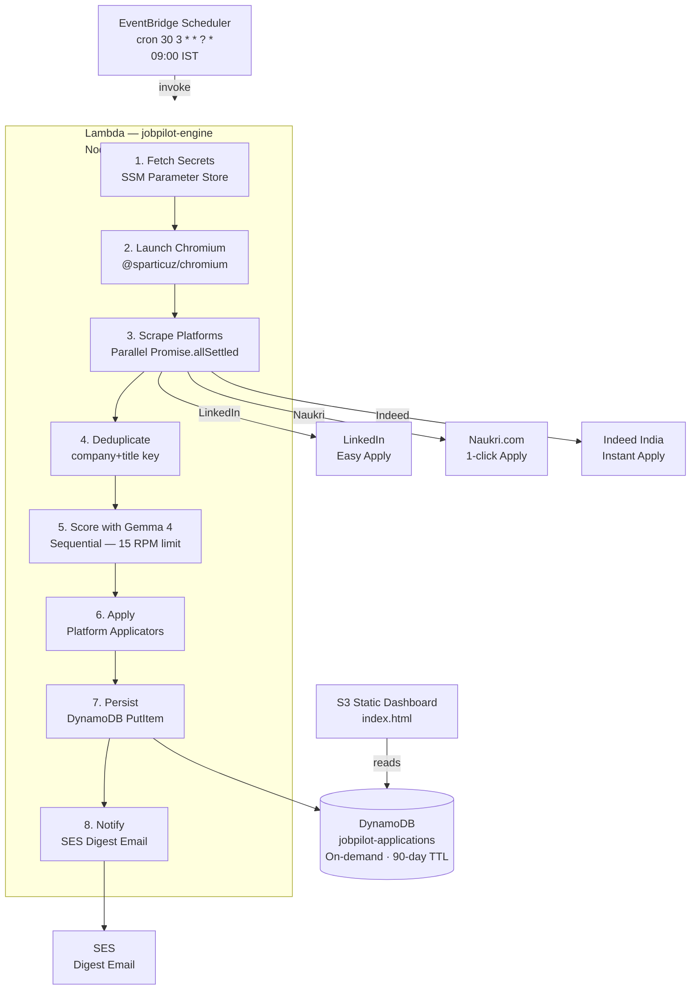

# Design Document — JobPilot Engine

## Overview

JobPilot Engine is a fully serverless, zero-cost automated job application pipeline. It runs once daily at 09:00 IST, triggered by AWS EventBridge Scheduler. A single AWS Lambda function (Node.js 20, 1 GB RAM, 300 s timeout) orchestrates the complete pipeline:

1. Fetch secrets from SSM Parameter Store
2. Launch a headless Chromium browser via `@sparticuz/chromium` + `puppeteer-core`
3. Scrape LinkedIn, Naukri.com, and Indeed India in parallel
4. Deduplicate the combined listing set
5. Score each listing against the candidate CV using Gemma 4 27B (Google AI Studio free tier)
6. Auto-apply to listings that score ≥ MATCH_THRESHOLD (default 75)
7. Persist every evaluated listing to DynamoDB with a 90-day TTL
8. Send a daily digest email via SES
9. Serve a static S3 dashboard for monitoring

All AWS services used (Lambda, DynamoDB, SES, S3, SSM, EventBridge) operate within their permanent free tiers, targeting a total monthly cost of $0.00.

---

## Architecture



### Key Design Decisions

**Single Lambda, sequential scoring**: Gemma 4 free tier allows 15 requests per minute. Running scores sequentially (not concurrently) naturally respects this limit without needing a rate-limiter.

**`Promise.allSettled` for scrapers**: Each platform scraper runs concurrently. A failure on one platform does not abort the others — the settled results are merged and the failed platform is logged.

**Conditional DynamoDB writes**: `attribute_not_exists(jobId)` ensures idempotency. Re-running the Lambda (e.g. manual invocation) will not double-count or double-apply.

**SSM failure isolation**: If any SSM fetch returns an empty string (network error, missing parameter), the dependent platform or feature is skipped rather than aborting the entire run.

**Browser cleanup in `finally`**: The Puppeteer browser is always closed in a `finally` block, preventing Lambda container memory leaks across warm invocations.

---

## Components and Interfaces

### 1. Handler (`handler.js` — `export const handler`)

Entry point. Orchestrates the full pipeline. Receives an EventBridge event or a manual invocation payload.

```
handler(event: AWSLambdaEvent): Promise<{ statusCode: 200, body: string }>
```

### 2. SSM Loader (`getParam`)

```
getParam(name: string): Promise<string>
```

Fetches a single SSM SecureString parameter. Returns `''` on error and logs the failure. Never throws.

### 3. Scrapers

Each scraper accepts a Puppeteer `Browser` instance and optional credentials. Returns an array of `JobListing` objects or an empty array on failure.

```
scrapeLinkedIn(browser, email: string, pass: string): Promise<JobListing[]>
scrapeNaukri(browser, email: string, pass: string):   Promise<JobListing[]>
scrapeIndeed(browser):                                Promise<JobListing[]>
```

### 4. Deduplicator (`deduplicateJobs`)

```
deduplicateJobs(jobs: JobListing[]): JobListing[]
```

Normalises `company.toLowerCase().trim() + '::' + title.toLowerCase().trim()` as a composite key. Retains first occurrence, discards subsequent duplicates.

### 5. Scorer (`scoreWithGemma4`)

```
scoreWithGemma4(job: JobListing, cvText: string): Promise<ScoreResult>
```

Sends a structured prompt to `gemma-4-27b-it` via `@google/genai`. Parses the JSON response. On any failure returns `{ score: 60, reason: 'Scoring unavailable — defaulting to 60%', redFlags: 'none' }`.

### 6. Score Response Parser (`parseScoreResponse`)

```
parseScoreResponse(rawText: string): ScoreResult
```

Strips markdown code fences, parses JSON, and fills in defaults for missing fields:
- `score` → `60` if absent or non-numeric
- `reason` → `'No reason provided'` if absent
- `redFlags` → `'none'` if absent

### 7. Applicators

```
applyLinkedIn(browser, job: JobListing): Promise<boolean>
applyNaukri(browser, job: JobListing):   Promise<boolean>
applyIndeed(browser, job: JobListing):   Promise<boolean>
applyToJob(browser, job: JobListing):    Promise<boolean>   // router
```

Each applicator opens a new page, navigates to the job URL, and attempts submission. Returns `true` on success, `false` on any failure. Never throws.

### 8. DynamoDB Persistence (`saveJobRecord`, `checkAlreadyApplied`)

```
saveJobRecord(job: JobRecord): Promise<void>
checkAlreadyApplied(jobId: string): Promise<boolean>
```

`saveJobRecord` uses a conditional `PutItem`. `checkAlreadyApplied` uses a `Query` with `Limit: 1`.

### 9. Digest Notifier (`sendDigestEmail`)

```
sendDigestEmail(to: string, results: RunResults): Promise<void>
```

Formats a plain-text digest and sends via SES. Errors are caught and logged; they do not fail the Lambda invocation.

### 10. Stealth Utilities

```
stealthPage(page: Page): Promise<void>   // user-agent, headers, request interception
humanType(page, selector, text): Promise<void>   // randomised keystroke delay 60–110 ms
autoScroll(page, times): Promise<void>   // incremental scroll to trigger lazy loading
```

---

## Data Models

### `JobListing` (in-memory, scraped)

```typescript
interface JobListing {
  id:        string;   // platform-prefixed unique ID (e.g. "li-123456", "nk-789", "in-abc")
  title:     string;
  company:   string;
  location:  string;
  salary:    string;   // empty string if not stated
  url:       string;
  platform:  'LinkedIn' | 'Naukri' | 'Indeed';
  easyApply: boolean;
}
```

### `ScoreResult` (in-memory, from Gemma 4)

```typescript
interface ScoreResult {
  score:    number;   // integer 0–100
  reason:   string;   // one-sentence explanation
  redFlags: string;   // mismatch description or "none"
}
```

### `JobRecord` (DynamoDB item — table: `jobpilot-applications`)

| Attribute   | DynamoDB Type | Description                                      |
|-------------|---------------|--------------------------------------------------|
| `jobId`     | S (Hash Key)  | Platform-prefixed unique ID                      |
| `title`     | S             | Job title                                        |
| `company`   | S             | Company name                                     |
| `platform`  | S             | LinkedIn / Naukri / Indeed                       |
| `location`  | S             | Job location string                              |
| `salary`    | S             | Salary string or empty                           |
| `url`       | S             | Direct job URL                                   |
| `score`     | N             | Gemma 4 match score (0–100)                      |
| `reason`    | S             | One-sentence score rationale                     |
| `status`    | S             | Applied / Skipped / Error                        |
| `appliedAt` | S             | ISO 8601 timestamp                               |
| `expiresAt` | N             | Unix epoch — 90 days from write (DynamoDB TTL)   |

### `RunResults` (in-memory, for digest)

```typescript
interface RunResults {
  applied:  Array<JobListing & ScoreResult>;
  skipped:  Array<JobListing & ScoreResult & { redFlags: string }>;
  errors:   Array<{ company: string; reason: string }>;
}
```

### SSM Parameter Map

| SSM Path                      | Type          | Used By              |
|-------------------------------|---------------|----------------------|
| `/jobpilot/linkedin/email`    | SecureString  | LinkedIn Scraper     |
| `/jobpilot/linkedin/password` | SecureString  | LinkedIn Scraper     |
| `/jobpilot/naukri/email`      | SecureString  | Naukri Scraper       |
| `/jobpilot/naukri/password`   | SecureString  | Naukri Scraper       |
| `/jobpilot/gemini/apikey`     | SecureString  | Scorer               |
| `/jobpilot/cv/text`           | SecureString  | Scorer               |
| `/jobpilot/notify/email`      | String        | Digest Notifier      |
| `/jobpilot/candidate/phone`   | SecureString  | LinkedIn Applicator  |

---

## Correctness Properties

*A property is a characteristic or behavior that should hold true across all valid executions of a system — essentially, a formal statement about what the system should do. Properties serve as the bridge between human-readable specifications and machine-verifiable correctness guarantees.*

### Property 1: Deduplication eliminates all duplicate company+title pairs

*For any* list of job listings (including duplicates across platforms), after deduplication no two listings in the result share the same normalised `company::title` composite key.

**Validates: Requirements 6.1, 6.2**

---

### Property 2: Already-applied jobs are excluded from scoring and application

*For any* job whose `jobId` already exists in DynamoDB with status `Applied`, the engine must not score it or attempt to apply to it in a subsequent run.

**Validates: Requirements 6.3**

---

### Property 3: Score response round-trip

*For any* valid JSON string produced by the Gemma 4 scorer (with or without markdown code fences), parsing it with `parseScoreResponse` and then re-serialising the result to JSON and re-parsing it must produce an equivalent object with numeric `score`, string `reason`, and string `redFlags`.

**Validates: Requirements 17.1, 17.5**

---

### Property 4: Missing score fields receive correct defaults

*For any* JSON object returned by the scorer that is missing one or more of `score`, `reason`, or `redFlags`, `parseScoreResponse` must substitute the correct defaults (`60`, `'No reason provided'`, `'none'` respectively) and the result must always have all three fields present with the correct types.

**Validates: Requirements 17.2, 17.3, 17.4**

---

### Property 5: Application count never exceeds MAX_APPLY_PER_RUN

*For any* run with any number of qualifying job listings, the total number of successful application submissions must not exceed `MAX_APPLY_PER_RUN` (default 10).

**Validates: Requirements 11.1, 11.3**

---

### Property 6: DynamoDB writes are idempotent

*For any* `JobRecord`, writing it twice to DynamoDB (same `jobId`) must result in exactly one record in the table — the second write must be silently ignored via the conditional expression.

**Validates: Requirements 12.4**

---

### Property 7: Job records contain all required fields

*For any* job that is scored, the persisted `JobRecord` must contain all required fields: `jobId`, `title`, `company`, `platform`, `location`, `salary`, `url`, `score`, `reason`, `status`, `appliedAt`, and `expiresAt`.

**Validates: Requirements 12.1, 12.2**

---

### Property 8: TTL is always 90 days in the future

*For any* `JobRecord` written to DynamoDB, the `expiresAt` value must equal the write timestamp (in Unix seconds) plus exactly 90 × 24 × 60 × 60 seconds (7,776,000 seconds).

**Validates: Requirements 12.3**

---

### Property 9: Stealth page blocks image/font/media requests

*For any* Puppeteer page initialised with `stealthPage`, all requests of resource type `image`, `font`, or `media` must be aborted, and all other resource types must be allowed to continue.

**Validates: Requirements 14.2, 3.6**

---

### Property 10: Human typing delay is within the specified range

*For any* call to `humanType`, the per-character delay used must be between 60 ms and 110 ms (inclusive).

**Validates: Requirements 14.3**

---

## Error Handling

| Failure Scenario | Behaviour |
|---|---|
| SSM parameter fetch fails | Log parameter name + error; return `''`; skip dependent platform/feature |
| LinkedIn auth fails | Log error; return `[]`; continue with other platforms |
| Naukri auth fails | Log error; return `[]`; continue with other platforms |
| Any scraper page load timeout (30 s) | Log timeout; return `[]` |
| Gemma 4 API call fails or returns unparseable JSON | Return default score `{ score: 60, reason: 'Scoring unavailable — defaulting to 60%', redFlags: 'none' }` |
| LinkedIn Easy Apply button not found | Log skip reason; return `false`; record as Error |
| Naukri apply button not found | Log skip reason; return `false`; record as Error |
| Indeed apply button / iframe not found | Log skip reason; return `false`; record as Error |
| DynamoDB write fails (non-conditional) | Log error; continue processing remaining jobs |
| DynamoDB conditional check failure (duplicate) | Silently ignore |
| SES send fails | Log SES error; return `{ statusCode: 200 }` — digest failure does not fail the run |
| Lambda timeout approaching (300 s) | Partial results already persisted to DynamoDB; browser closed in `finally` |

---

## Testing Strategy

### Dual Testing Approach

Both unit tests and property-based tests are required. They are complementary:
- Unit tests catch concrete bugs in specific scenarios and integration points.
- Property-based tests verify universal correctness across a wide range of generated inputs.

### Unit Tests

Focus areas:
- `deduplicateJobs`: specific examples with known duplicates and cross-platform collisions
- `parseScoreResponse`: concrete examples of valid JSON, JSON with missing fields, JSON wrapped in markdown fences, and completely invalid strings
- `saveJobRecord` / `checkAlreadyApplied`: integration tests against a DynamoDB Local instance
- `sendDigestEmail`: verify the formatted email body contains all required sections
- `applyToJob` router: verify correct platform handler is called for each platform value
- SSM failure isolation: verify that a failed `getParam` does not abort the run

### Property-Based Tests

**Library**: [`fast-check`](https://github.com/dubzzz/fast-check) (TypeScript/Node.js)

**Configuration**: minimum 100 iterations per property test (`numRuns: 100`).

Each property test must include a comment referencing the design property it validates:

```
// Feature: jobpilot-engine, Property N: <property_text>
```

| Property | Test Description | fast-check Arbitraries |
|---|---|---|
| P1 — Deduplication | Generate random arrays of `JobListing` with injected duplicates; assert result has no duplicate `company::title` keys | `fc.array(fc.record({ company: fc.string(), title: fc.string(), ... }))` |
| P2 — Already-applied exclusion | Generate a `jobId`, pre-seed DynamoDB, run pipeline; assert job is not in applied/scored output | `fc.string()` for jobId |
| P3 — Score round-trip | Generate random `ScoreResult` objects, serialise to JSON, parse with `parseScoreResponse`, re-serialise, re-parse; assert equivalence | `fc.record({ score: fc.integer(0,100), reason: fc.string(), redFlags: fc.string() })` |
| P4 — Missing field defaults | Generate partial score JSON objects (any subset of fields missing); assert all three fields always present with correct types after parsing | `fc.record({ score: fc.option(fc.integer(0,100)), reason: fc.option(fc.string()), redFlags: fc.option(fc.string()) })` |
| P5 — Apply count cap | Generate lists of N qualifying jobs (N > MAX_APPLY_PER_RUN); assert applied count ≤ MAX_APPLY_PER_RUN | `fc.array(jobListingArb, { minLength: 11, maxLength: 50 })` |
| P6 — DynamoDB idempotency | Generate a `JobRecord`, write it twice; assert table contains exactly one item with that `jobId` | `fc.record(jobRecordArb)` |
| P7 — Record completeness | Generate any `JobListing` + `ScoreResult`; call `saveJobRecord`; read back; assert all 12 required fields present | `fc.tuple(jobListingArb, scoreResultArb)` |
| P8 — TTL correctness | Generate any write timestamp; assert `expiresAt = timestamp + 7776000` | `fc.integer({ min: 0, max: 2_000_000_000 })` |
| P9 — Stealth request blocking | Generate random resource types; assert `image`, `font`, `media` are aborted and all others continue | `fc.constantFrom('image','font','media','script','xhr','fetch','document')` |
| P10 — Typing delay range | Instrument `humanType` to record per-character delays; assert all delays ∈ [60, 110] ms | `fc.string({ minLength: 1, maxLength: 50 })` |
