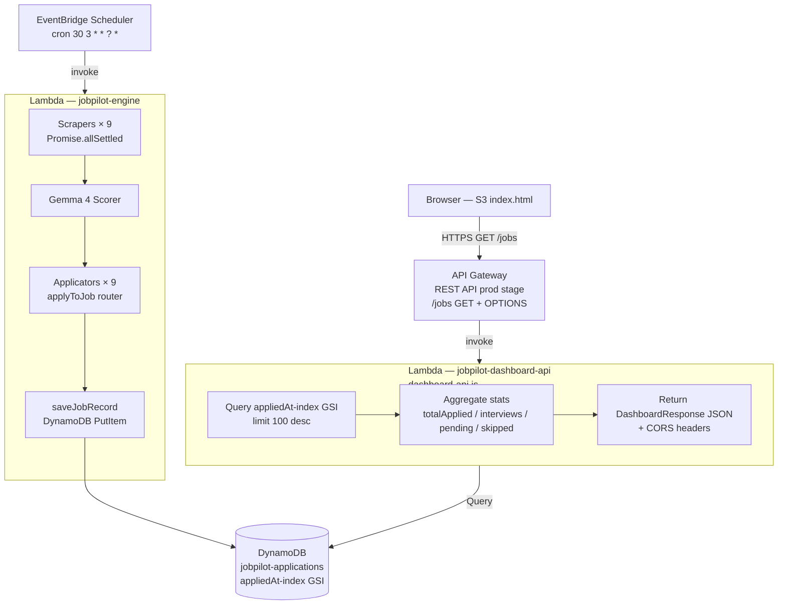

# Design Document — JobPilot Extended Platforms

## Overview

This feature extends the existing JobPilot engine in two directions:

1. **Six new scrapers and applicators** — Internshala, Shine.com, TimesJobs, Wellfound, Glassdoor, and Unstop are added to `handler.js`, following the identical scrape → score → apply → persist pipeline already established for LinkedIn, Naukri, and Indeed.

2. **Live dashboard** — The static `index.html` is upgraded from hardcoded seed data to real-time DynamoDB reads. A new read-only Lambda (`dashboard-api.js`) sits behind an API Gateway REST endpoint. The dashboard fetches from this endpoint on load and polls every 60 seconds.

All new infrastructure stays within AWS free-tier limits. The Dashboard API Lambda and API Gateway add negligible cost (well under $0.50/month at expected call volume).

---

## Architecture



### Key Design Decisions

**Separate Dashboard API Lambda**: The dashboard read path is isolated from the engine write path. This keeps IAM permissions minimal (read-only for the dashboard Lambda), avoids any risk of the dashboard triggering engine side-effects, and allows independent deployment and scaling.

**GSI on `appliedAt`**: A full table Scan would be expensive and slow as the table grows. The `appliedAt-index` GSI (hash key: `appliedAt`, sort key: `platform`) enables efficient time-ordered queries. The Dashboard API falls back to a Scan only if the GSI query fails.

**API Gateway REST API with CORS**: The S3-hosted dashboard is a browser origin. API Gateway handles the OPTIONS preflight and injects `Access-Control-Allow-Origin: *` headers so the browser Fetch API can call the endpoint without a proxy.

**`API_URL` constant in dashboard**: The invoke URL is only known after `terraform apply`. Placing it in a single `const API_URL` at the top of the inline script means the URL can be updated with a simple string replacement without touching application logic.

**Platform enable flags in CONFIG**: Each new platform has an independent boolean flag (`INTERNSHALA_ENABLED`, etc.). Setting a flag to `false` skips both the scraper and applicator for that platform without any code change.

**SSM failure isolation for new platforms**: If a credential fetch fails for Internshala, Shine, Wellfound, or Glassdoor, the engine logs the error and skips that platform. TimesJobs and Unstop require no authentication, so they are unaffected by SSM failures.

---

## Components and Interfaces

### New Scrapers (added to `handler.js`)

Each scraper follows the same signature as the existing three:

```
scrapeInternshala(browser): Promise<JobListing[]>
scrapeShine(browser, email: string, pass: string): Promise<JobListing[]>
scrapeTimesJobs(browser): Promise<JobListing[]>
scrapeWellfound(browser): Promise<JobListing[]>
scrapeGlassdoor(browser): Promise<JobListing[]>
scrapeUnstop(browser): Promise<JobListing[]>
```

- Internshala, TimesJobs, Wellfound, Glassdoor (search page), and Unstop do not require authentication for the search results page.
- Shine requires email/password credentials from SSM.
- All scrapers call `stealthPage(page)` before navigating.
- All scrapers block image/font/media via request interception (existing `stealthPage` utility).
- All scrapers return `[]` on a 30-second page-load timeout and log the error.
- All scrapers extract up to 20 listings with fields: `id`, `title`, `company`, `location`, `salary`, `url`, `platform`, `easyApply`.

### New Applicators (added to `handler.js`)

```
applyInternshala(browser, job: JobListing): Promise<boolean>
applyShine(browser, job: JobListing):       Promise<boolean>
applyTimesJobs(browser, job: JobListing):   Promise<boolean>
applyWellfound(browser, job: JobListing):   Promise<boolean>
applyGlassdoor(browser, job: JobListing):   Promise<boolean>
applyUnstop(browser, job: JobListing):      Promise<boolean>
```

All applicators follow the same contract as the existing three:
- Navigate to `job.url`; click the primary apply button.
- Iterate up to 5 steps for multi-step forms (Internshala, Wellfound, Glassdoor native, Unstop).
- Confirm dialogs/modals where present (Shine, TimesJobs).
- Glassdoor: if the apply button redirects externally, log the redirect and return `false`.
- Return `true` on success, `false` on any failure. Never throw.

### Extended `applyToJob` Router (updated in `handler.js`)

```
applyToJob(browser, job: JobListing): Promise<boolean>
```

Extended switch statement to handle all nine platform identifiers:

```javascript
switch (job.platform) {
  case 'LinkedIn':    return applyLinkedIn(browser, job);
  case 'Naukri':      return applyNaukri(browser, job);
  case 'Indeed':      return applyIndeed(browser, job);
  case 'Internshala': return applyInternshala(browser, job);
  case 'Shine':       return applyShine(browser, job);
  case 'TimesJobs':   return applyTimesJobs(browser, job);
  case 'Wellfound':   return applyWellfound(browser, job);
  case 'Glassdoor':   return applyGlassdoor(browser, job);
  case 'Unstop':      return applyUnstop(browser, job);
  default:            return false;
}
```

### Dashboard API Lambda (`dashboard-api.js`)

New file, separate from `handler.js`.

```
handler(event: APIGatewayProxyEvent): Promise<APIGatewayProxyResult>
```

Internal helpers:

```
queryRecentRecords(): Promise<JobRecord[]>
  // Queries appliedAt-index GSI, limit 100, falls back to Scan on GSI failure

aggregateStats(items: JobRecord[]): StatsObject
  // Counts totalApplied, interviews, pending, skipped from status field

buildResponse(statusCode: number, body: object): APIGatewayProxyResult
  // Adds CORS headers to every response
```

---

## Data Models

### `JobListing` — extended `platform` union (in-memory)

```typescript
interface JobListing {
  id:        string;
  title:     string;
  company:   string;
  location:  string;
  salary:    string;
  url:       string;
  platform:  'LinkedIn' | 'Naukri' | 'Indeed'
           | 'Internshala' | 'Shine' | 'TimesJobs'
           | 'Wellfound' | 'Glassdoor' | 'Unstop';
  easyApply: boolean;
}
```

No changes to the DynamoDB `JobRecord` schema — the `platform` field already accepts any string.

### `DashboardResponse` (new — returned by Dashboard API)

```typescript
interface DashboardResponse {
  items:       JobRecord[];          // up to 100, sorted by appliedAt desc
  stats: {
    totalApplied: number;
    interviews:   number;
    pending:      number;
    skipped:      number;
  };
  lastUpdated: string;               // ISO 8601 timestamp of query execution
}
```

### Extended SSM Parameter Map

| SSM Path                          | Type         | Used By              |
|-----------------------------------|--------------|----------------------|
| `/jobpilot/internshala/email`     | SecureString | Internshala Applicator (optional login) |
| `/jobpilot/internshala/password`  | SecureString | Internshala Applicator |
| `/jobpilot/shine/email`           | SecureString | Shine Scraper + Applicator |
| `/jobpilot/shine/password`        | SecureString | Shine Scraper + Applicator |
| `/jobpilot/wellfound/email`       | SecureString | Wellfound Applicator |
| `/jobpilot/wellfound/password`    | SecureString | Wellfound Applicator |
| `/jobpilot/glassdoor/email`       | SecureString | Glassdoor Applicator |
| `/jobpilot/glassdoor/password`    | SecureString | Glassdoor Applicator |

TimesJobs and Unstop require no credentials.

### Extended CONFIG Object

```javascript
const CONFIG = {
  // existing
  MATCH_THRESHOLD:   75,
  MAX_APPLY_PER_RUN: 10,
  APPLY_DELAY_MS:    35_000,
  LINKEDIN_ENABLED:  true,
  NAUKRI_ENABLED:    true,
  INDEED_ENABLED:    true,
  // new
  INTERNSHALA_ENABLED: true,
  SHINE_ENABLED:       true,
  TIMESJOBS_ENABLED:   true,
  WELLFOUND_ENABLED:   true,
  GLASSDOOR_ENABLED:   true,
  UNSTOP_ENABLED:      true,
};
```

---

## Correctness Properties

*A property is a characteristic or behavior that should hold true across all valid executions of a system — essentially, a formal statement about what the system should do. Properties serve as the bridge between human-readable specifications and machine-verifiable correctness guarantees.*

### Property 1: Scraped listings contain all required fields

*For any* job listing returned by any of the nine scrapers, the listing must contain all required fields: `id`, `title`, `company`, `location`, `salary`, `url`, and `platform` — and the `platform` field must match the scraper's platform identifier.

**Validates: Requirements 1.2, 3.2, 5.2, 7.2, 9.2, 11.2**

---

### Property 2: Platform enable flag gates scraper invocation

*For any* combination of platform enable flags in CONFIG, only platforms whose flag is `true` should have their scraper added to the `scrapers` array passed to `Promise.allSettled`. A platform with its flag set to `false` must never appear in the scraped results.

**Validates: Requirements 13.2**

---

### Property 3: `applyToJob` router handles all nine platform identifiers

*For any* of the nine platform identifier strings (`LinkedIn`, `Naukri`, `Indeed`, `Internshala`, `Shine`, `TimesJobs`, `Wellfound`, `Glassdoor`, `Unstop`), the `applyToJob` router must not return `false` due to an unknown platform — it must delegate to the correct platform handler.

**Validates: Requirements 13.3**

---

### Property 4: Dashboard API response shape is always valid

*For any* set of DynamoDB records (including empty sets), the Dashboard API response must always be a JSON object containing an `items` array, a `stats` object with numeric `totalApplied`, `interviews`, `pending`, and `skipped` fields, and a `lastUpdated` ISO 8601 string.

**Validates: Requirements 15.3**

---

### Property 5: Dashboard API response round-trip

*For any* valid `DashboardResponse` object, serialising it to JSON with `JSON.stringify` and then parsing it back with `JSON.parse` must produce an equivalent object — the `items` array length, all `stats` counts, and the `lastUpdated` string must be identical.

**Validates: Requirements 20.4**

---

### Property 6: Stats aggregation correctness

*For any* array of `JobRecord` items, the `aggregateStats` function must return counts where `totalApplied + skipped + pending + interviews` equals the total number of items, and each count equals the number of items whose `status` field matches the corresponding category.

**Validates: Requirements 15.3**

---

### Property 7: Dashboard response parser defensive defaults

*For any* JSON object that is missing the `items` field or has a non-array `items` value, the dashboard parser must treat `items` as an empty array. *For any* JSON object where any `stats` count is missing or non-numeric, the display value for that stat must be `'—'` rather than crashing.

**Validates: Requirements 20.2, 20.3**

---

### Property 8: SSM failure isolation for new platforms

*For any* SSM parameter fetch failure for a new platform credential, the engine must log the error and skip only the dependent platform — the remaining platforms must continue to be scraped and applied to normally.

**Validates: Requirements 14.3**

---

## Error Handling

| Failure Scenario | Behaviour |
|---|---|
| New platform scraper page load timeout (30 s) | Log timeout; return `[]`; continue with other platforms |
| Shine SSM credential fetch fails | Log parameter name + error; skip Shine scraper and applicator; continue |
| Wellfound SSM credential fetch fails | Log parameter name + error; skip Wellfound applicator; continue |
| Glassdoor SSM credential fetch fails | Log parameter name + error; skip Glassdoor applicator; continue |
| Glassdoor sign-in overlay detected | Attempt to dismiss overlay; continue extraction; return `[]` if dismissal fails |
| Glassdoor apply button redirects externally | Log external redirect; return `false`; record as Error |
| Any new applicator: apply button not found | Log skip reason; return `false`; record as Error |
| Any new applicator: unrecoverable error | Log error; return `false`; record as Error |
| Dashboard API: DynamoDB GSI query fails | Fall back to full table Scan; log GSI failure |
| Dashboard API: DynamoDB Scan also fails | Return HTTP 500 with `{"error": "Failed to fetch records"}` |
| Dashboard API: any unhandled exception | Return HTTP 500 with `{"error": "Failed to fetch records"}`; log stack trace |
| Dashboard fetch: non-200 response | Display error message in jobs table area; retain last successfully loaded data |
| Dashboard fetch: network error | Display error message; retain last successfully loaded data (or empty state on first load) |
| Dashboard fetch: malformed JSON | Treat `items` as `[]`; display `—` for all stat cards |

---

## Testing Strategy

### Dual Testing Approach

- **Unit tests**: specific examples, edge cases, error conditions (timeout handling, missing apply button, SSM failure, malformed API response)
- **Property-based tests**: universal properties across all inputs (field completeness, stats aggregation, response round-trip, platform flag gating)

### Unit Tests

Focus areas:
- Each new scraper: verify correct URL construction and field extraction against mock DOM
- Each new applicator: verify correct button selectors and step iteration logic
- `applyToJob` router: verify all 9 platform cases delegate correctly
- `aggregateStats`: verify counts for known input arrays
- Dashboard API handler: verify HTTP 200 success path and HTTP 500 error path
- Dashboard parser: verify defensive defaults for missing/invalid fields
- CORS headers: verify `Access-Control-Allow-Origin: *` is present on all responses

### Property-Based Tests

**Library**: `fast-check` (already a dev dependency)

**Configuration**: minimum 100 iterations per property test (`numRuns: 100`)

Tag format: `// Feature: jobpilot-extended-platforms, Property N: <property_text>`

| Property | Test Description | fast-check Arbitraries |
|---|---|---|
| P1 — Scraped listing field completeness | Generate mock scraper output; assert all required fields present and platform matches | `fc.record({ id: fc.string(), title: fc.string(), company: fc.string(), ... })` |
| P2 — Platform flag gating | Generate random boolean flag combinations; assert only enabled platforms appear in scrapers array | `fc.record({ INTERNSHALA_ENABLED: fc.boolean(), SHINE_ENABLED: fc.boolean(), ... })` |
| P3 — Router completeness | Generate any of 9 platform strings; assert router delegates (does not return false for unknown) | `fc.constantFrom('LinkedIn','Naukri','Indeed','Internshala','Shine','TimesJobs','Wellfound','Glassdoor','Unstop')` |
| P4 — API response shape | Generate random arrays of JobRecord; call Dashboard API handler with mock DynamoDB; assert response has items, stats, lastUpdated | `fc.array(jobRecordArb, { maxLength: 100 })` |
| P5 — Response round-trip | Generate random DashboardResponse; JSON.stringify then JSON.parse; assert equivalence | `fc.record({ items: fc.array(jobRecordArb), stats: statsArb, lastUpdated: fc.string() })` |
| P6 — Stats aggregation | Generate random arrays of JobRecord with random status values; assert sum of all stat counts equals array length | `fc.array(fc.record({ status: fc.constantFrom('Applied','Interview','Pending','Skipped','Error') }))` |
| P7 — Parser defensive defaults | Generate random objects with missing/invalid items and stats fields; assert items defaults to [] and invalid stats display as '—' | `fc.record({ items: fc.option(fc.anything()), stats: fc.option(fc.record({ totalApplied: fc.option(fc.anything()) })) })` |
| P8 — SSM failure isolation | Mock getParam to fail for one random new platform; run engine; assert other platforms still scraped | `fc.constantFrom('internshala','shine','wellfound','glassdoor')` |
